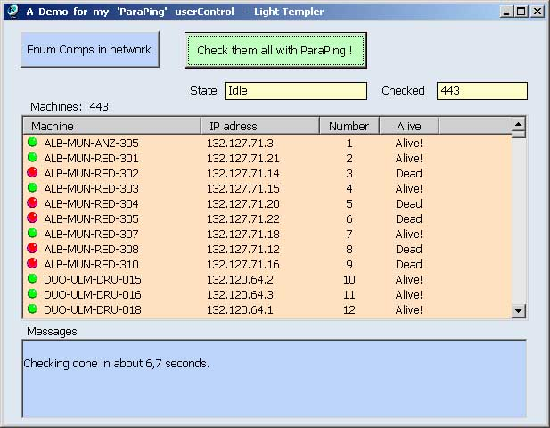



## ParaPing 1\.0 \- A usercontrol by Light Templer

### Description

A self contained usercontrol in pure VB for checking hundreds or thousands computers for 'running' or 'switch off' within a few seconds by parallel PINGs. The VB way of threading ;-)

You get a clear powerfull interface, well commented

code in a readable (imho good ;-) ) style and two examples how to use. More description is included on top of the uc source.

Enjoy! Comments are welcome, votes are motivating :-)

----

Regards LiTe
 
### More Info
 

             |
---                |---
**Submitted On**   |2005-04-05 16:49:34
**By**             |[Light Templer](https://github.com/Planet-Source-Code/PSCIndex/blob/master/ByAuthor/light-templer.md)
**Level**          |Advanced
**User Rating**    |4.7 (66 globes from 14 users)
**Compatibility**  |VB 6\.0
**Category**       |[Object Oriented Programming \(OOP\)](https://github.com/Planet-Source-Code/PSCIndex/blob/master/ByCategory/object-oriented-programming-oop__1-47.md)
**World**          |[Visual Basic](https://github.com/Planet-Source-Code/PSCIndex/blob/master/ByWorld/visual-basic.md)
**Archive File**   |[ParaPing\_1189890692005\.zip](https://github.com/Planet-Source-Code/light-templer-paraping-1-0-a-usercontrol-by-light-templer__1-61005/archive/master.zip)

